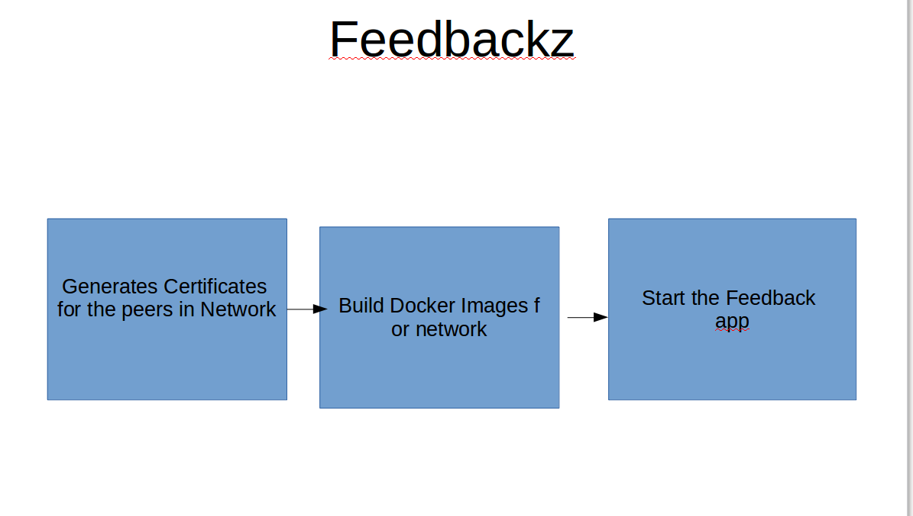

<h1>Feedbackz - blockchain mobile app to report incident/feedback<h1>
<h2>Introduction</h2>
    This is mobile (android and iOS) feedback app created using ionic 3 application in client side and Node.JS in server side. We are using Hyperledger Fabric as blockchain technology as distributed database.

This app will empower the people by leveraging the security and anonymity of decentralized systems. 
It enables users to file an anonymous feedback or report an incident anonymously pertaining to areas of Governance, Police or Administration. It is fully decentralized hence tamper-proof by any authority.

<h3>Technology used</h3>
<li>1. Ionic 3 (Angular 4 + TypeScript + Jquery + HTML + CSS etc);<li>
<li>2. Node.JS as backend library + Express.JS as backend framework.</li>
<li>3. Blockchain technology - Hyperledger fabric </li>
    - Chaincode - Golang
    - Docker

-Generate Certificates for peers
-Build Docker images for network
-Start the insurance network

</img>

Dev Notes to run this app.

1. git clone https://github.com/rjayaswal/Feedback-blockchain.git
2. cd Feedback-blockchain/FeedbackClient/
3. npm install
4. ionic serve #this will start ionic client app in browser. You may generate apk file using following command:
    - ionic cordova build android (for android)
    - ionic cordova build ios (for iOS)

Now to run hyperledeger blockchain:

1. Download the docker images
2. Run the application

Details notes present in playbookREADME.md file inside blockchain folder.

